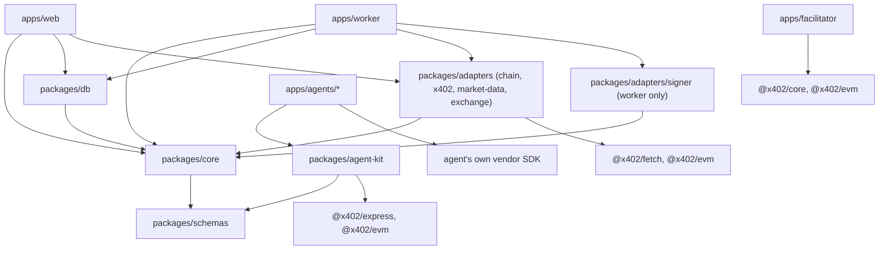
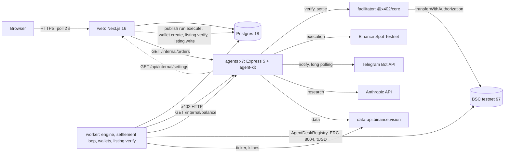
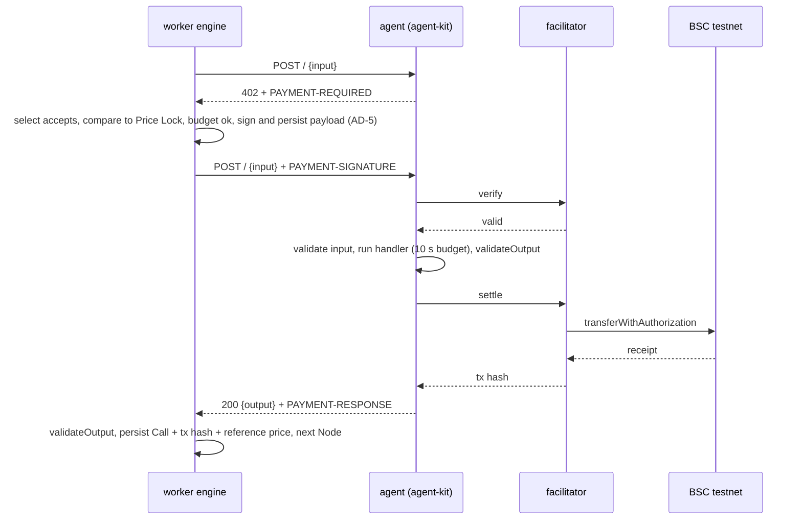
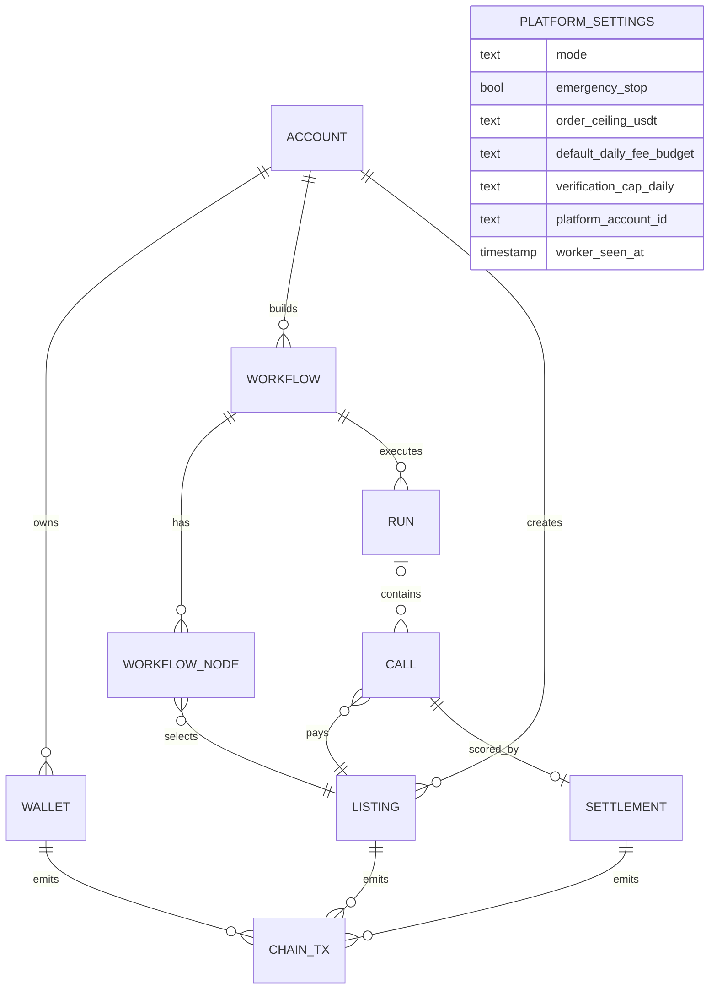
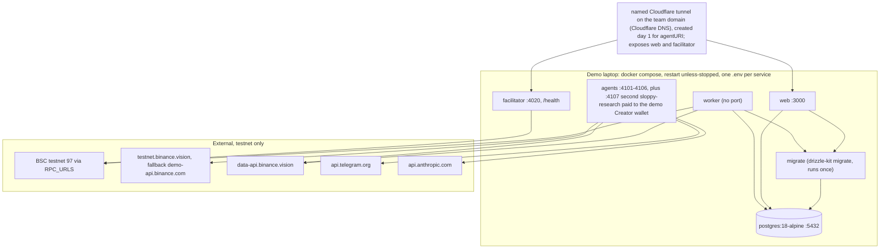

# Architecture Spine — AgentDesk

## Design Paradigm

**Modular monolith with ports and adapters**, one pnpm monorepo, all TypeScript. The domain (`packages/core`) owns entities, the Run state machine, budget and stake policy, settlement scoring, the mode constants, and the ports. One adapters package (`packages/adapters`, sub-modules `chain/`, `signer/`, `x402/`, `market-data/`, `exchange/`) implements the ports. Hosts (`apps/*`) wire adapters into core and expose HTTP or run jobs. The run engine is **pipes and filters**: a Run is a linear list of Nodes; each Node passes through the same filters in order (skip decision → deadline check → lock check → 402 → pay → validate → persist), fed by the previous Node's output. `notify` is the terminal filter, fed from Run context, and runs on every Run end. Agents are separate, self-contained processes behind HTTP; they carry their own vendor clients and never share code with core.

| Layer | Directory | May import |
| --- | --- | --- |
| Contracts | `contracts/` | nothing from the monorepo |
| Shared contract | `packages/schemas` | nothing |
| Agent runtime | `packages/agent-kit`, `apps/agents/*` | `schemas`, x402 packages, the agent's own vendor SDK |
| Domain and ports | `packages/core` | `schemas` |
| Persistence | `packages/db` | `schemas`, `core` types |
| Adapters | `packages/adapters/*` | `core`, `schemas`, vendor SDKs |
| Hosts | `apps/web`, `apps/worker`, `apps/facilitator`, `scripts/` | `core`, `db`, `adapters`, `schemas` |

## Invariants & Rules



### AD-1 — Dependency direction is inward only [ADOPTED]

- **Binds:** all packages and apps
- **Prevents:** agents coupling to platform internals; core depending on a vendor SDK; signing code reachable from web
- **Rule:** imports follow the diagram above and nothing else. `apps/agents/*` import only `packages/schemas`, `packages/agent-kit`, and the vendor SDK that agent needs (`@binance/spot`, grammY, `@anthropic-ai/sdk`); only `alpha-research` calls the LLM. `packages/agent-kit` imports only `packages/schemas` and x402 packages. `packages/core` imports only `packages/schemas`. `packages/adapters/signer` is imported only by `apps/worker` and `scripts/`, and `MASTER_KEY` appears only in the worker's env schema and compose service. Nothing imports from an `apps/*` directory. Enforced by `eslint no-restricted-imports` in each package.

### AD-2 — The chain is the system of record for Listings, written through one listing pipeline [ADOPTED]

- **Binds:** FR-5..FR-14, FR-33..FR-38, FR-42, marketplace and listing views, `listing.verify`, `listing.write`
- **Prevents:** reputation, stake, or price disagreeing between the database and the contract; two writers of the listings cache; a stake locked for a listing that never passes verification; an `agentURI` nobody can repair
- **Rule:** `AgentDeskRegistry` holds price, stake (tUSD), reputation (basis points), pause flags, payout wallet, endpoint, and the ERC-8004 `agentId`. `POST /api/listings` inserts the `listings` row in `status = 'verifying'` with the form-owned columns (`name`, `description`, `type`, `endpoint`, `declared_price`, `declared_stake`, `payout_wallet`, `creator_account_id`) and publishes `listing.verify` (singleton key `listing_id`). `listing.verify` runs the verification Call, then `IdentityRegistry.register(agentURI)`, then `list(...)` with the stake, each step only after the previous succeeded, so a failed verification locks no stake and mints no identity; any refusal sets `status = 'failed'` with `last_error`. Listing statuses are exactly `verifying`, `failed`, `active`, `paused`; marketplace, Workflow Builder, and Price Lock read only `active` and `paused`. The chain-owned columns (`price`, `stake`, `reputation_bps`, `paused_by_creator`, `paused_by_stake`, `payout_wallet`, `endpoint`, `agent_id`, `registry_listing_id`) are written by one function, `refreshListingFromChain(listingId)` in `packages/db`, called by `chainWrite` after every receipt whose intent names the listing and by `POST /api/listings/<id>/refresh`; nothing else writes them. Price history is the `list:` row plus `price:` rows of `chain_tx`; reputation history is the `reputation:` rows. The Creator wallet signs `register` and `list` and owns the `agentId`, which the worker decodes from the `Registered` event in the transaction receipt. `agentURI` is `PUBLIC_BASE_URL/api/listings/<id>/agent.json`; `PUBLIC_BASE_URL` is the named-tunnel hostname on the team domain added to Cloudflare DNS on day 1 (a quick tunnel's random host is never used for it), `pnpm doctor` fails when it is a loopback, Docker-internal, or `trycloudflare.com` host and any `identity:` row exists, and `identity-uri:<listing_id>:<n>` (`setAgentURI`) repairs URIs after a host change.

### AD-3 — Postgres is the system of record for everything off-chain; derived amounts are queries, never counters

- **Binds:** accounts, wallets, workflows, workflow_nodes, listings, runs, calls, settlements, chain_tx, platform_settings, FR-3, FR-25, FR-28, FR-40
- **Prevents:** state living in worker memory or inside an agent; counters drifting from the rows they summarise; two spend or reservation queries counting different statuses; a payments table nobody writes
- **Rule:** a Run, Call, or Settlement exists only as a row. There is no `payments` table: a payment is the Call row (`from` the Run's wallet, `to` `locked_pay_to`, `amount` `locked_price`, status the Call status, hash `payment_tx_hash`), and FR-40 is a query over `calls` joined to `runs` and `listings`. The `calls` columns fixed at cold-start: `id`, `run_id` (nullable), `kind` (`run`, `verification`), `listing_id`, `node_index`, `node_type`, `status`, `locked_price`, `locked_pay_to`, `locked_asset`, `locked_network`, `request`, `response`, `payment_required` (every 402 payload received), `payment_payload` (the decoded signed authorization: `nonce`, `validBefore`, `from`, `to`, `value`), `payment_tx_hash` (nullable), `attempt`, `reference_price`, `reference_at`, `failure_reason`, `skip_reason`, `started_at`, `ended_at`. `reference_price` is production `lastPrice` through the `MarketData` port (`lastPrice`, `ticker24h`, `klines`, defined in `core/ports` on day 1) within five seconds of success; a failed read leaves it null. Daily Fee Budget spend for an account = `locked_price` of its Calls in `paid_awaiting_result`, `succeeded`, `failed_after_payment`, plus `pending` Calls of Runs still `running`, since the later of UTC midnight and `accounts.budget_window_start` (an Operator reset sets it to now; `accounts.daily_fee_budget` null means the platform default). Stake reservation for a Listing = `locked_price` of its `research` and `risk` Calls in `paid_awaiting_result`, `succeeded`, `failed_after_payment` that have no `settlements` row; stake is read from the listings cache. The Platform Wallet's verification spend is the same query over `kind = 'verification'` Calls in the last 24 h. Agents keep no platform state.

### AD-4 — Only the worker transitions Runs and Calls; web inserts them whole; one Run per Workflow; notify is the terminal filter [ADOPTED]

- **Binds:** `apps/web`, `apps/worker`, `packages/core/run`, FR-15..FR-30
- **Prevents:** a web request and the engine advancing the same Run; two Runs of one Workflow executing together; lazily created Call rows that break budget reservation; two writers ending one Run; a failed Run that never notifies; ad-hoc status strings
- **Rule:** `POST /api/runs` builds the Price Lock from `active` Listings, runs the budget and balance checks (tUSD balance >= Price Lock total; no BNB check, because the facilitator relays EIP-3009 transfers) in one transaction that takes `SELECT ... FOR UPDATE` on the account row, and answers 409 `refused_budget`, `refused_balance`, `wallet_not_ready`, or `run_in_progress` (the partial unique index `runs(workflow_id) where status = 'running'`) without inserting anything; a passing request inserts the Run in `running` with `created_at` and one `pending` Call per Node in the same transaction, then publishes `run.execute` with singleton key `workflow_id` (concurrency 4 across Workflows). The worker sets `started_at` at pickup and only transitions rows, through `core/run/machine.ts`, which accepts only the PRD enums (Call: `pending`, `price_mismatch`, `payment_failed`, `paid_awaiting_result`, `succeeded`, `failed_after_payment`, `skipped`; Run: `running`, `completed`, `completed, no order`, `failed at <Node>`, `timed out`). Every Run status write is a compare-and-set from `running`; zero rows updated means another writer ended the Run, and the engine records the in-flight Call's outcome and exits. `run.execute` is resumable: on entry it loads the Run and continues from the first non-terminal Call; a Call in `paid_awaiting_result` with `attempt < 2` is resent with the stored header, otherwise resolved by AD-6. The engine checks `started_at + 120 s` before each Node and each paid retry; the settlement loop marks `running` Runs older than 120 s plus 45 s grace as `timed out` and publishes `run.execute { finalize: true }`, on which the engine runs only the `notify` filter. At Run end every still-`pending` Call becomes `skipped` with `skip_reason` `not_reached`, `hold`, or `reject`. A Run ends `completed` only when an `execution` Call returned `FILLED` or the Workflow has no `execution` Node; every other successful end, including a `REJECTED` execution, is `completed, no order`; `<Node>` is the Type name; `runs.failure_reason` carries the reason. The `notify` Node runs on every Run end with an engine-built input (PRD addendum §1); a `notify` failure ends a still-running Run as `failed at notify` (FR-29), while a Run already failed or timed out keeps its status and the Call carries the failure. A refusal inside the signer lock records the Call `payment_failed` with `failure_reason` `refused_budget` or `refused_stake` and the Run `failed at <Node>`. One worker instance runs in the MVP.

### AD-5 — Signing policy in core, keys behind one Signer port, wired only in the worker

- **Binds:** FR-1, FR-2, FR-5..FR-7, FR-9, FR-11, FR-25, FR-35, every x402 payment and every chain transaction, wallet creation
- **Prevents:** private keys or `MASTER_KEY` loaded in web or agents; nonce collisions between the engine and settlement on the same wallet; a web handler signing a creator transaction; a wallet used before it can pay
- **Rule:** `core/signing` holds policy: one async mutex per wallet, and inside the lock the Daily Fee Budget, FR-25 stake reservation, Creator ten-times minimum, Platform Wallet verification cap, and Creator gas-floor checks, then `signPayment(walletId, requirements)` and `sendTx(walletId, intent)`. It calls the `Signer` port (`generateKey`, `decryptKey`, `signTypedData`, `sendRawTx`) implemented in `packages/adapters/signer` over viem and Node crypto (AES-256-GCM under `MASTER_KEY`); only `apps/worker` and `scripts/` wire it. `signPayment` writes `calls.payment_payload` and moves the Call to `paid_awaiting_result` in the same transaction before the paid request is sent, so a retry never re-signs. Sign-up inserts the account and publishes `wallet.create` (singleton key `account_id`); the job runs `gas:<wallet_id>` (BNB top-up from the Platform Wallet to `WALLET_GAS_FLOOR`), `mint:<wallet_id>` (tUSD, demo mode only), then `approve:<wallet_id>` (`tUSD.approve(registry, max)` signed by the new wallet), and sets `wallets.ready_at` from the approve receipt; listings, runs, and `listing.write` answer 409 `wallet_not_ready` before that. The Platform Wallet is an ordinary `wallets` row of `platform_account_id`, imported by `pnpm seed` from `PLATFORM_WALLET_KEY`, which nothing else reads. Creator chain writes after listing (stake top-up, price change, pause) go through `listing.write`; web allocates the intent key at enqueue and never signs. The facilitator relayer key is a separate key that lives only in `apps/facilitator`.

### AD-6 — One x402 binding for engine, agents, and facilitator [ADOPTED]

- **Binds:** `packages/agent-kit`, `packages/adapters/x402`, `apps/facilitator`, `contracts/TUSD.sol`, public schema page, FR-5..FR-7, FR-15, FR-16, FR-23, FR-26, FR-27
- **Prevents:** engine and agents implementing different x402 versions, schemes, assets, or EIP-712 domains; a landed payment recorded as `payment_failed`; two comparison rules for the Price Lock
- **Rule:** x402 v2 only: headers `PAYMENT-REQUIRED`, `PAYMENT-SIGNATURE`, `PAYMENT-RESPONSE`; scheme `exact`; network `eip155:97`; asset `tUSD` (team EIP-3009 token); facilitator at `FACILITATOR_URL`, self-hosted from `@x402/core`. `deployments/97.json` carries `tusd: { address, name, version, decimals }` and the registry addresses; `packages/schemas` derives from it one `x402Config` (`network`, `asset`, `extra: { name, version }`, `facilitatorUrl`) that agent-kit uses to build every 402 as an explicit `AssetAmount` with `extra` (there is no default asset for `eip155:97`, and client and facilitator reject a 402 without `extra`), the facilitator registers the same asset from it, `forge test` asserts `eip712Domain()` matches, and the schema page prints them. Agents use `@x402/express`; the engine uses `@x402/fetch` with a signer from AD-5. The engine selects the first `accepts` entry whose `scheme`, `network` (exact string), and `asset` (`isAddressEqual`) match the lock, then compares `payTo` with `isAddressEqual` and `amount` as `bigint`; no match or any difference is `price_mismatch`, with both values in `calls.payment_required` and `failure_reason`; a 402 whose `maxTimeoutSeconds` exceeds 15 is refused the same way. One signature per Call; the paid request is retried at most once with the same header (the 15 s paid timeout covers the handler plus one settlement receipt, which AD-7's replay cache absorbs when the receipt is slow). The middleware verifies, runs the handler, then settles; a handler error returns 5xx and is never settled. When both paid attempts end without a `PAYMENT-RESPONSE`, the engine reads `tUSD.authorizationState(from, nonce)` from `payment_payload`: unused means `payment_failed`, used means `failed_after_payment` with `payment_tx_hash` null. The schema page is signed-out, renders the five Type schemas from `packages/schemas` (`z.toJSONSchema`) with the shared `samples`, and publishes facilitator URL, scheme, network, asset, and EIP-712 domain from the same config.

### AD-7 — Every platform-built agent uses agent-kit

- **Binds:** six seed agents, the sample third-party agent, verification Call (FR-11), FR-44
- **Prevents:** six hand-rolled 402 flows; input and output shapes drifting from the Type schemas; a handler that outlives the paid timeout; a handler that runs twice for one payment
- **Rule:** `createAgent({ type, price, payTo, handler, internalRoutes? })` mounts `POST /` behind the x402 middleware, `GET /health`, `GET /schema`, and any `internalRoutes` under `/internal/*` guarded by `Authorization: Bearer INTERNAL_TOKEN`; `price` is a decimal USDT string converted by AD-14's helpers when the 402 is built. Before the handler it validates the request and after it calls `validateOutput` (AD-14); an invalid output is a 500, not a 200. The kit enforces a 10 s handler budget and answers 500 on expiry; handlers keep external timeouts at or below 8 s, and `alpha-research` falls back as PRD addendum §2 states. The kit is single-flight per `PAYMENT-SIGNATURE`: a concurrent duplicate awaits the in-flight attempt; the handler output is cached for five minutes even when `settle` fails, and a retry re-attempts `settle` with the cached output instead of re-running the handler. Agents hold no database connection and no platform key. A third-party agent may use the raw x402 middleware instead; the engine's `validateOutput` is the guard for every agent.

### AD-8 — Chain writes are intent-first and idempotent

- **Binds:** wallet gas, mint, approval, identity, listing, stake top-up, price change, pause, slash, reputation refresh, FR-7..FR-9, FR-12, FR-25, FR-35..FR-37, FR-42
- **Prevents:** a worker retry slashing twice or registering twice; a two-step flow skipping its second step; a retry allocating a new key; history readers guessing the payload
- **Rule:** `chainWrite(intentKey, buildTx)` inserts a `chain_tx` row (`intent_key` unique, `payload`, `status` in `pending`, `confirmed`, `reverted`, `failed`, `tx_hash`, `confirmed_at`) before sending; if the row exists, it re-checks the receipt instead of sending. Domain rows are updated only from `confirmed`; `reverted` or `failed` writes `listings.last_error` for listing intents. One intent key per transaction: `gas:<wallet_id>`, `mint:<wallet_id>`, `approve:<wallet_id>`, `identity:<listing_id>`, `identity-uri:<listing_id>:<n>`, `list:<listing_id>`, `stake:<listing_id>:<n>`, `price:<listing_id>:<n>`, `pause:<listing_id>:<n>`, `slash:<call_id>`, `reputation:<listing_id>:<settlement_id>`; `<n>` is the epoch millisecond allocated by the enqueuing handler and carried in the job payload, never computed by the job. Listing intent payloads are `{ listing_id, before: { price, stake, paused }, after: { ... } }` captured at enqueue. `pnpm --filter contracts build` exports the ABI JSON of `AgentDeskRegistry`, `TUSD`, and the ERC-8004 `IdentityRegistry` into `packages/adapters/chain/abi/`; adapters import only those. `callRef` is `keccak256(call_id)`.

### AD-9 — Settlement is one in-process worker loop that settles each Call once

- **Binds:** FR-33..FR-38, FR-41, settlement view, dashboard, timeout sweep
- **Prevents:** the engine or a web handler scoring a Call; double slash; a refund separate from its slash; a poll cadence pg-boss cannot honour; a settlement view that cannot show what it scored; a reservation never released
- **Rule:** the worker runs the settlement loop in-process as a `setTimeout` chain that re-reads `platform_settings.mode` each iteration and sleeps the mode's poll interval from the mode constants in `packages/core`; the same `runSettlementTick` also serves the targeted pg-boss job `settlement.tick { call_id }` and performs the AD-4 timeout sweep. Every `research` or `risk` Call that reaches `succeeded` or `failed_after_payment` receives exactly one `settlements` row (unique index on `call_id`) with `result` in `passed`, `failed`, `not_scored` (reason `reject_decision`, `no_fill`, `no_reference_price`), `mode`, the verbatim `rule_label` (demo: "demo settlement rule: 24h trend"), the prices used, `scored_at`, and `slash_amount`. Scoring reads the `MarketData` port only, never the paid `data` agent. The research start price is the Call's own `reference_price`; for a `risk` Call, `p_fill` is the same Run's `FILLED` `execution` Call's `reference_price`, and absent that the row is `not_scored` on the first tick after the Run ends. The window starts at `calls.ended_at`; the mode read at tick time governs. A `failed_after_payment` Call is scored with no window when the engine publishes `settlement.tick` for it, with `scored_at = failed_at`. Slash is one transaction, `slash(listingId, callRef, amount = locked price, to = the Run's Builder System Wallet)`, through AD-8 with the `call_id` key; the contract clamps to the remaining stake and emits `Slashed`, and `slash_amount` is read from that event. Reputation = `passed / (passed + failed)` over the last 30 rows with result in (`passed`, `failed`), written under the `reputation:` key only when a `passed` or `failed` row is added; the marketplace label derives from that count, and zero rows means "no score yet".

### AD-10 — Runtime switches live in the database, secrets in env, addresses in the deployments file

- **Binds:** Operator page (FR-45), FR-14, worker loop, execution agent, mode table in PRD addendum §6
- **Prevents:** a restart to flip Emergency Stop or demo mode; a third-party agent needing database access; a non-platform account listing an `execution` agent; a contract address typed twice
- **Rule:** the single-row `platform_settings` table (`id = 1`, inserted by the migration) holds `mode` (`production`, `demo`), `emergency_stop`, `order_ceiling_usdt` (default 1000), `default_daily_fee_budget`, `verification_cap_daily`, `platform_account_id`, seed toggles, and `worker_seen_at`; the worker reads it every loop iteration and the API on every request. `POST /api/listings` rejects `type = execution` unless the caller is `platform_account_id` (409 `refused_execution_type`). The per-mode values of PRD addendum §6 are a constant table in `packages/core` keyed by `mode`. `GET /api/settings/public` returns `mode` and `emergency_stop` for every signed-in user; Operator routes live under `/api/operator/*` and check `is_operator` server-side. Env holds only secrets and URLs, validated by a Zod schema at boot; contract addresses come only from `deployments/97.json` through AD-14's typed export, selected by `CHAIN_ID`. Platform-operated agents read `emergency_stop` and `order_ceiling_usdt` from `GET /api/internal/settings` on every request.

### AD-11 — Exchange access lives only in the execution agent [ADOPTED]

- **Binds:** FR-24, FR-30..FR-32, `apps/agents/spot-executor`, `packages/adapters/exchange`
- **Prevents:** exchange keys in the worker or web; two exchange integrations; two enforcers of Emergency Stop; an undefined outcome below the exchange minimum
- **Rule:** `apps/agents/spot-executor` owns the `@binance/spot` client (Ed25519 key) behind its own `Exchange` port: `placeMarketOrder({ symbol, side, quoteQty })`, `getOrder(symbol, orderId)`, `getBalance()`; Spot Demo Mode is the same client with `EXCHANGE_BASE_URL=https://demo-api.binance.com` (bare host) and its own key pair `EXCHANGE_DEMO_API_KEY` / `EXCHANGE_DEMO_PRIVATE_KEY`, provisioned on day 1 from a regular Binance account's Demo Trading page; `pnpm doctor` pings both hosts. The executor alone enforces Emergency Stop and `order_ceiling_usdt`, always as a paid, schema-valid `REJECTED` (reason `settings unavailable` when `/api/internal/settings` cannot be read). It exposes `GET /internal/balance` and `GET /internal/orders/<order_id>?symbol=` (AD-7) with the `InternalBalance` and `InternalOrder` shapes of AD-14; the engine calls the first through the `ExchangeBalance` port before the `risk` Node to fill `balance_usdt`, and `GET /api/runs/<id>/order` proxies the second for the Run view's "verify on Binance" action. The engine enforces only the per-workflow Order Cap and the exchange minimum notional (5 USDT) before paying: a `size_usdt` above the cap or below the minimum fails the `execution` Call before payment, the Run ends `failed at execution`, and `notify` still runs. The engine passes only `symbol`, `side`, `size_usdt`.

### AD-12 — Live views poll, nothing pushes [ADOPTED]

- **Binds:** `apps/web` run view, dashboard, marketplace, wallet and listing progress
- **Prevents:** a second transport (SSE, WebSocket) that the tunnel cannot carry
- **Rule:** `GET /api/runs/<id>` returns the full Run with Calls and Settlements; React Query refetches every 2 s while the Run, its Settlements, a wallet without `ready_at`, or a listing in `verifying` is unfinished, and `GET /api/settings/public` is polled with the dashboard header. No server push anywhere. Telegram updates reach the notifier by grammY long polling (`AGENT_TELEGRAM_POLL=true`, set only in compose), never by webhook.

### AD-13 — Money is integer base units off the wire; every shared value has one format

- **Binds:** every package, the API, the database, the UI
- **Prevents:** float money math; two representations of the same amount; two address or id formats
- **Rule:** token amounts (prices, stakes, slashes, budgets) are stored in the database, returned by the platform API, and sent to the chain and the x402 `amount` field as base-unit integer strings (tUSD has 6 decimals); UI components render decimals labelled `tUSD`. `AGENT_PRICE`, `createAgent({ price })`, the listing form, and every Type payload carry decimal USDT strings as PRD addendum §1 defines. Order sizes and exchange prices are decimal strings in USDT. Timestamps are ISO 8601 UTC. Ids are ULIDs with a type prefix (`acc_`, `wal_`, `wf_`, `lst_`, `run_`, `call_`, `stl_`). Addresses and tx hashes are stored lower-case, compared with `isAddressEqual`, and rendered checksummed as explorer links through one `explorerLink()` helper over `EXPLORER_URL`.

### AD-14 — Every cross-process contract lives in packages/schemas

- **Binds:** web, worker, agents, agent-kit, scripts, contracts build output
- **Prevents:** five builders inventing job payloads, API bodies, internal bodies, error codes, unit conversions, or address sources
- **Rule:** `packages/schemas` holds, as Zod 4 objects: the five Type schemas with `samples[type]` and `validateOutput(type, input, output)` implementing every PRD addendum §1 rule including cross-field ones; the Price Lock; `jobs/` (every pg-boss payload); `api/` (every `/api/*` request and response body, the error envelope, and the fixed codes `validation_failed`, `unauthorized`, `forbidden`, `not_found`, `conflict`, `run_in_progress`, `wallet_not_ready`, `refused_budget`, `refused_balance`, `refused_stake`, `refused_execution_type`, `verification_failed` in `api/errors.ts`, snake_case, new codes added there); `internal/` (`InternalBalance { balance_usdt }`, `InternalOrder { order_id, raw }`, `InternalSettings { emergency_stop, order_ceiling_usdt }`); `toBaseUnits(decimal): bigint` and `toDecimalUsdt(base): string` over `TUSD_DECIMALS = 6` with branded types `BaseUnits` and `UsdtDecimal` as the only conversions in the repo; and `deployments.ts`, which imports `deployments/97.json` at build time and exports it typed. Both sides of every boundary parse with these schemas. `listing.verify` substitutes `PLATFORM_CHAT_ID` and `run_id: null` into the `notify` sample before sending.

## Consistency Conventions

| Concern | Convention |
| --- | --- |
| Naming | Packages and apps kebab-case; DB tables snake_case plural (`accounts`, `wallets`, `workflows`, `workflow_nodes`, `listings`, `runs`, `calls`, `settlements`, `chain_tx`, `platform_settings`); TS types PascalCase; pg-boss queues `run.execute`, `wallet.create`, `listing.verify`, `listing.write` created with `policy: 'exclusive'` (one queued or active job per singleton key) and `settlement.tick` as a plain queue for targeted sends; route handlers in `apps/web/app/api`; agent env vars prefixed `AGENT_`; every service has `INTERNAL_TOKEN` |
| Routes | Public, signed-out: `/schema`, `/api/listings/<id>/agent.json`, `/api/health`. Session: `/api/<resource>`, `/api/settings/public`, `GET /api/runs/<id>/order`, `POST /api/listings/<id>/refresh`. Operator: `/api/operator/*`. Internal, token only, no session: `/api/internal/*` on web and `/internal/*` on agents, `Authorization: Bearer INTERNAL_TOKEN`. Agent endpoints are `https://`, with an `http://` allow-list of `localhost`, `127.0.0.1`, `host.docker.internal`, and compose service names |
| Data & formats | Status enums verbatim from the PRD and this spine, stored as text; API error envelope `{ "error": { "code", "message", "details?" } }`; list endpoints return `{ "items": [], "next": null }`; `calls.payment_tx_hash` nullable and `notify.cost_table[].tx_hash` omitted when unknown |
| State & cross-cutting | Every process validates env with Zod at boot and exits on failure; pino JSON logs with `run_id`, `call_id`, `tx_hash` fields where known; auth is email + bcrypt password in an iron-session cookie with an `is_operator` flag on `accounts`; x402 timeouts 15 s unpaid and 15 s paid; chain reads and sends go through viem `fallback()` over `RPC_URLS` with three retries, and a payment signature is never regenerated; receipts awaited up to 60 s, then `chain_tx` stays `pending` and the next loop iteration re-checks; the facilitator relayer uses viem's `nonceManager`; `TELEGRAM_BOT_TOKEN` only in `telegram-notifier`; `PLATFORM_CHAT_ID` only in the worker; `GET /api/health` pings the database, `GET /health` on facilitator and agents, worker heartbeat `platform_settings.worker_seen_at` per loop iteration |
| Migrations & tests | Drizzle migrations run by one compose service `migrate` that web and worker depend on (`service_completed_successfully`); one owner lands the ER schema on day 1, others add columns by PR; unit tests with Vitest, contract rules with `forge test`; no local chain, integration is `pnpm doctor` plus rehearsal Runs on testnet; no e2e |

## Stack

| Name | Version |
| --- | --- |
| Node.js | 24.20 LTS |
| pnpm | 11.25 |
| Next.js | 16.3.4 |
| React | 19.2.8 |
| Tailwind CSS | 4 (create-next-app default) |
| shadcn/ui | CLI-vendored components, current at day 1 |
| @xyflow/react | 12.11.6 |
| @tanstack/react-query | 5.102.8 |
| iron-session | 9.0.1 |
| Express | 5.2.1 |
| @x402/core, @x402/evm, @x402/express, @x402/fetch | 2.25.0 |
| viem | 2.56.3 |
| Drizzle ORM / drizzle-kit | 0.45.2 / 0.31.10 |
| PostgreSQL (docker image) | postgres:18-alpine |
| pg-boss | 12.30.0 |
| Zod | 4.5.4 |
| @binance/spot | 32.0.3 |
| grammY | 1.46.0 |
| @anthropic-ai/sdk (model claude-sonnet-5) | 0.124.0 |
| Foundry | 1.8.1 |
| openzeppelin-contracts (ERC20, EIP712, `draft-ERC3009.sol`) | v5.7.0 GitHub tag via forge install |
| BSC testnet | chain id 97, RPC `https://bsc-testnet-dataseed.bnbchain.org` plus fallbacks in `RPC_URLS` |
| ERC-8004 IdentityRegistry (BSC testnet) | `0x8004A818BFB912233c491871b3d84c89A494BD9e`, confirmed on day 1 and written to `deployments/97.json` |
| Binance Spot Testnet REST | `https://testnet.binance.vision/api`, fallback `https://demo-api.binance.com/api` |
| Binance public market data | `https://data-api.binance.vision` |
| Explorer | `https://testnet.bscscan.com` |

`packageManager` in the root `package.json` pins pnpm 11.25 (pnpm 12 removes flags). `@x402/*` depend on Zod 3, which pnpm isolates; `packages/schemas` imports Zod 4 explicitly. Packages not listed (pino, bcrypt, eslint, Vitest) are installed at their current version on day 1 and pinned by the lockfile.

## Structural Seed







`AgentDeskRegistry` surface at cold-start, all amounts in tUSD pulled by `transferFrom` after the wallet's one-time approval: `list(agentId, agentType, price, endpoint, payTo, stakeAmount)` (reverts when stake is below ten times price), `addStake(listingId, amount)` (clears the stake pause when stake reaches ten times price), `setPrice(listingId, price)` (reverts when stake would fall below ten times price), `setPaused(listingId, bool)` by the creator (creator pause, cleared only by the creator), `slash(listingId, callRef, amount, to)` (clamps to remaining stake, transfers tUSD to `to`, sets the stake pause at zero) and `setReputation(listingId, bps)` by the platform address, `getListing(listingId)`. Events: `Listed`, `Staked`, `PriceSet`, `Paused`, `Slashed(listingId, callRef, amount)`, `ReputationSet`. `TUSD` is `ERC20, ERC3009` from OpenZeppelin `draft-ERC3009.sol` (random-nonce mapping, `authorizationState(address, bytes32)`, the `(v, r, s)` overload the facilitator calls), domain `EIP712("tUSD", "1")`, with an open `mint(to, amount)` capped per call for testnet; `ERC20TransferAuthorization` is excluded because its keyed sequential nonces revert on the x402 client's random nonces. Stake withdrawal is deferred.



Environments: `production` and `demo` are values of `platform_settings.mode` on the same deployment, not separate deployments; PRD addendum §6 owns their values through the mode constants. Contracts are deployed once per chain by `forge script`, which writes `deployments/97.json`; every in-repo process reads addresses from it through `packages/schemas/deployments.ts`, and third-party agents copy them from the schema page. Three keys pay gas: the Platform Wallet (slash, reputation, verification Calls, wallet gas top-ups), the facilitator relayer (every x402 settlement), and Creator wallets (`register`, `list`, `listing.write`); Builder System Wallets need no BNB beyond the top-up. Each has a BNB floor in `.env.example`; `pnpm doctor` asserts the floors, facilitator and RPC health, relayer pending nonces, the worker heartbeat, the exchange balance, and `PUBLIC_BASE_URL`, and `pnpm seed` refuses to run below a floor. The Platform Wallet and relayer are funded from the BSC testnet faucet on day 1. `MASTER_KEY`, `PLATFORM_WALLET_KEY`, the relayer key, and `deployments/97.json` are stored in the team password manager before the day-1 deploy so a second laptop can restore `.env` and run `docker compose up`. `pnpm seed` requires a running worker: it creates two Builder and two Creator accounts plus one spare pair through `wallet.create`, applies the demo budgets, lists the seed agents (`execution` with `skip_verification`, accepted only from the seed), writes `.env.seed` with `AGENT_PAYTO` for the :4107 instance and restarts it, and prints the exact agent URL to paste in the listing demo; `pnpm seed --warm` executes three real Runs of the good chain in demo mode and waits for settlement; `pnpm seed --activate-spare` swaps in the spare pair; `pnpm seed --reset` truncates every table including `chain_tx` and registers fresh identities; `pnpm seed --rehost` repairs `agentURI`s. Database backups are unnecessary; the recorded demo is the fallback when chain, RPC, or LLM are down.

```text
agent-desk/
  apps/
    web/             # Next.js 16: pages, route handlers /api/*, inserts runs, listings, wallets; enqueues jobs; read models; operator page; schema page
    worker/          # pg-boss jobs run.execute, wallet.create, listing.verify, listing.write, settlement.tick; in-process settlement loop; the only signer host
    facilitator/     # self-hosted x402 facilitator (@x402/core), relayer key, exact scheme on eip155:97
    agents/          # each agent owns its vendor client
      binance-ticker/  alpha-research/  sloppy-research/  guardrail-risk/  spot-executor/  telegram-notifier/
  packages/
    schemas/         # Zod 4: Type schemas, samples, validateOutput, Price Lock, jobs/, api/, internal/, errors, units, deployments.ts
    agent-kit/       # createAgent(): Express 5, @x402/express, validation, single-flight replay cache, /health, /schema, /internal/*
    core/            # run machine, node pipeline, signing policy, budget and stake rules, settlement scoring, mode constants, ports
    adapters/        # chain/ (viem, abi/), signer/ (worker only), x402/ (@x402/fetch), market-data/, exchange/ (HTTP to spot-executor)
    db/              # Drizzle schema, migrations, repositories, refreshListingFromChain
  scripts/           # seed, doctor (publish through pg-boss, wire adapters/signer)
  contracts/         # Foundry: AgentDeskRegistry.sol, TUSD.sol, script/Deploy.s.sol, test/
  deployments/97.json
  docker-compose.yml
  .env.example
```

## Capability → Architecture Map

| Capability / Area | Lives in | Governed by |
| --- | --- | --- |
| Stage 1: engine pays one agent (FR-3, FR-5..FR-7, FR-15, FR-16, FR-23, FR-25, FR-26, FR-28, FR-44 one agent) | `packages/schemas`, `packages/db`, `packages/agent-kit`, `core/run`, `core/signing`, `adapters/signer`, `adapters/x402`, `adapters/chain`, `apps/worker`, `apps/facilitator`, `contracts/TUSD.sol`, `contracts/AgentDeskRegistry.sol`, `apps/agents/binance-ticker`, schema page | AD-1, AD-2, AD-3, AD-4, AD-5, AD-6, AD-7, AD-8, AD-13, AD-14 |
| Stage 2: five-node run, execution, notify, operator (FR-4, FR-17..FR-22, FR-24, FR-29..FR-32, FR-44, FR-45) | `apps/web` builder and run view, remaining `apps/agents/*`, `adapters/exchange`, `adapters/market-data` | AD-4, AD-7, AD-10, AD-11, AD-12, AD-14 |
| Stage 3: accounts, wallets, listing flow, marketplace pages (FR-1, FR-2, FR-9..FR-14) | `apps/web` auth, listing, and marketplace pages, `wallet.create`, `listing.verify`, `listing.write` jobs, `adapters/chain`, `refreshListingFromChain` | AD-2, AD-5, AD-8, AD-10, AD-12 |
| Stage 4: settlement, slash, refund, reputation, stake reservation (FR-8, FR-27, FR-33..FR-38) | settlement loop, `core/settlement`, `adapters/market-data`, `adapters/chain` | AD-2, AD-3, AD-6, AD-8, AD-9 |
| Stage 5: dashboard and views (FR-39..FR-43) | `apps/web` read models over `calls`, `settlements`, `chain_tx` | AD-2, AD-3, AD-12, AD-13 |
| Security and custody NFRs | `core/signing`, `adapters/signer`, env validation, `INTERNAL_TOKEN`, `platform_account_id` | AD-1, AD-5, AD-10, AD-11, conventions |
| Demo reliability NFR (45 s run, 20 s window, warm scores, spare wallets) | `platform_settings.mode`, mode constants, settlement loop, `scripts/seed`, `scripts/doctor` | AD-9, AD-10, Structural Seed |

## Deferred

- Platform fee collection on the x402 rail: PRD non-goal; no hook is reserved in the contract or the engine.
- External wallets, withdrawals, and stake withdrawal: platform-managed custody stands for the MVP.
- Testnet USDT is not the payment asset; the team token tUSD is. Orders stay in USDT on the exchange. Revisit with the B402 switch.
- Binance Agent OS MCP is not in the build: direct REST for orders, `data-api.binance.vision` for market data; revisit when MCP targets Spot Testnet.
- opBNB is dropped; one chain, BSC testnet.
- Chain event indexing: revisit when an RPC with `eth_getLogs` is adopted; until then AD-2's receipt-driven cache is sufficient.
- Switching to the Binance B402 facilitator and the `permit2-exact` scheme: a config change in AD-6 plus a one-time Permit2 approval per System Wallet; re-check B402's daily payment cap then; wait for partner credentials.
- Per-builder exchange accounts or sub-accounts: Spot Testnet has none; one Platform Exchange Account stands.
- Parallel branches and fan-in: the Node list becomes a DAG later; the pipeline interface takes one input today.
- Writing to the ERC-8004 ReputationRegistry: reputation stays in `AgentDeskRegistry` only.
- Worker horizontal scaling and agent replicas: one instance each; exclusive-policy queues and the compare-and-set Run writes already make a second worker safe; the agent-kit replay cache is per process.
- Telegram deep-link onboarding, page layout, and theme: owned by the code.
- Rate limiting and abuse controls on public routes: the 1 USDT price ceiling and the daily verification cap are the only guards in the MVP.

## Open Questions

- Submission is a git link, a brief, and a narrated video (confirmed 2026-09-05); no public URL is required, so the tunnel exists only to give `agentURI` a stable host. If no team domain is on Cloudflare DNS by day 1, `agentURI` is a `data:application/json;base64,` URI carrying `agent.json` instead, decided once in `listing.verify` from `PUBLIC_BASE_URL` being set or empty.
- Day-1 checks before any other work: the x402 facilitator example accepts a custom EIP-3009 asset on `eip155:97` (else `apps/facilitator` becomes a small verify and settle server on `@x402/core` over viem); `ERC3009` from the openzeppelin-contracts v5.7.0 tag compiles under Foundry with the `(v, r, s)` overload (else vendor Circle's `EIP3009.sol`); the facilitator example runs with the Solana signer removed and `bscTestnet` plus `eip155:97` registered; the team domain is on Cloudflare DNS so the named tunnel hostname exists before the first `identity:` intent; the faucet address holds the 0.002 mainnet BNB the faucet requires.
